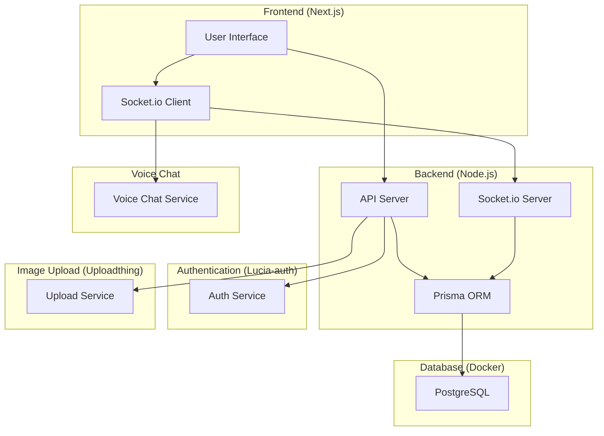
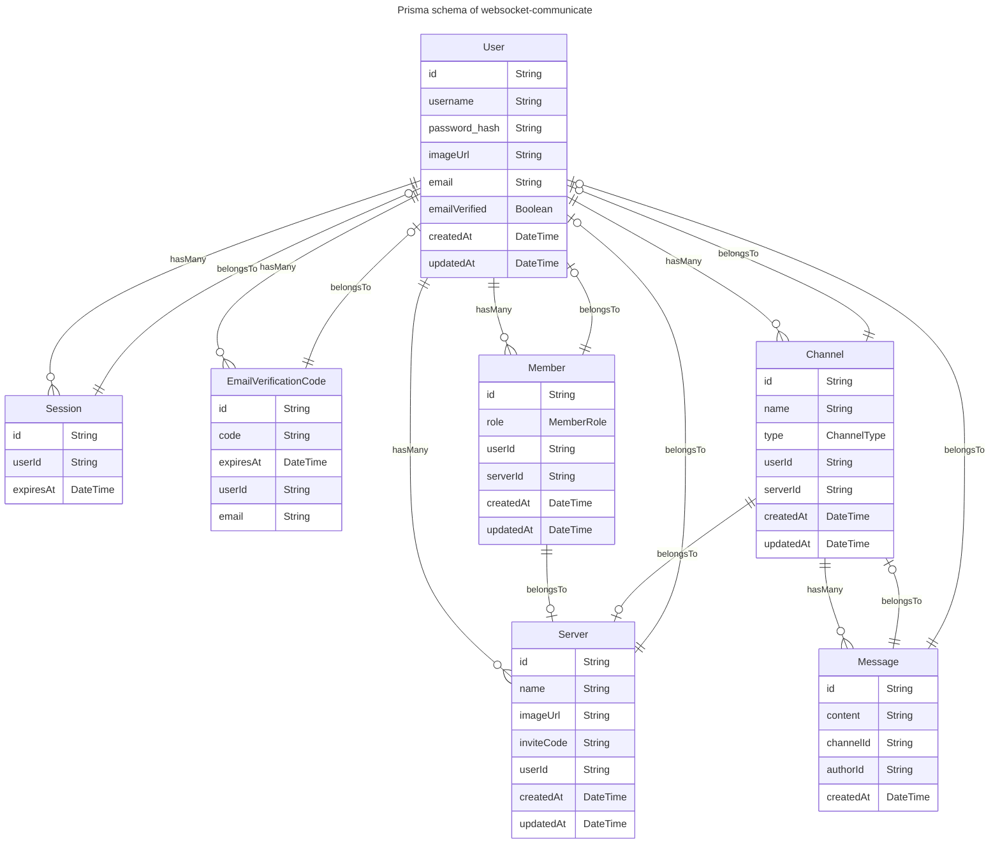

# SPEC-1: Discord Clone

## Background

This project aims to build a clone of Discord as a portfolio piece, demonstrating the ability to create a real-time messaging application with user management, channels, and roles. The application will be built using Next.js for the frontend, Prisma for database ORM, Docker for containerization, and Lucia-auth for authentication. Additional services like Socket.io for real-time messaging and Uploadthing for image uploads will be integrated.

## Requirements

The following requirements are categorized based on MoSCoW prioritization:

### Must Have
- Real-time messaging using Socket.io
- User authentication and authorization using Lucia-auth
- User profiles
- Channels for organizing conversations
- Servers for grouping channels and users
- Roles with permissions (User, Server Admin)

### Should Have
- Voice chat functionality
- Image upload via Uploadthing

### Could Have
- Custom emojis and reactions
- Server moderation tools

### Won't Have
- Video calls
- Extensive third-party integrations

## Method

### High-Level Architecture Design

The architecture for the Discord clone will include the following main components:
1. **Frontend**: Built with Next.js, it will handle the user interface and client-side logic.
2. **Backend**: Implemented with Node.js, it will use Socket.io for real-time communication and Prisma for database operations.
3. **Authentication**: Managed by Lucia-auth for user authentication and authorization.
4. **Database**: A relational database managed using Prisma ORM and containerized with Docker.
5. **Image Upload Service**: Integration with Uploadthing for handling image uploads.
6. **Voice Chat**: Using a service or library for handling real-time voice communication.

Here's the high-level component diagram:

## Schema of database

